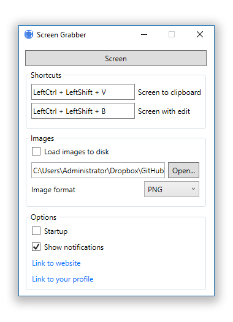

# ScreenGrabber

Do not use it! Use ShareX open source program for screenshoots.

ScreenGrabber is a free and open source program that lets you capture any area of your screen, edit with pencil and share it with a single press of a key. 

**1 click for screenshot**

# Features: 

- Capture any area
- Set hotkeys
- Draw on picture
- Copy image to buffer
- Set startup

# Screenshots:

Main Window:

Capture:

Editing:

   [softpedia]: <http://www.softpedia.com/get/Multimedia/Graphic/Graphic-Capture/qvepoy-Screen-Grabber.shtml>
   
# Review from [Softpedia][softpedia]:

**Capture any area of your screen with a simple hotkey, make basic annotations and copy the image to the clipboard or save it, with this lightweight utility**

Capturing desktop content is still quite difficult even with the release of Windows 10, so you are going to need to rely on a third-party utility if you take multiple screenshots on a daily basis.

Screen Grabber is one of the options at your disposal, a small and unobtrusive application that enables you to capture a certain area of your screen, perform some simple annotations and save the images locally or send them to the clipboard.

**Useful tool for those who take screenshots frequently**

Once you have installed and launched the program, it is minimized to the system tray automatically. In order to capture something from your screen, you just need to use a key combination and select the area.

Depending on the hotkey you use, the program will either save the image locally and copy it to the clipboard or open it in the built-in editor. Screenshots can be saved as PNG, JPG or BMP files.

**Comes with a rudimentary image editor**

The application gives you the option of performing some modifications before exporting the screenshot, although things are quite limited in this respect.

Essentially, you can only perform annotations using a red pencil tool or draw rectangles. It would certainly help if more editing options were available, or at least the possibility to change the default color.

**Simple screenshot tool that could use some improvements**

The biggest problem with Screen Grabber is that it lacks some features provided by other screen capture utilities, the most important of which being the ability to capture a certain window, object or application without selecting the area manually.

The editing tools at your disposal are also very limited, so much so that you are probably better off copying the image to the clipboard and using Paint to perform the modifications.

In the end, Screen Grabber is a straightforward, unobtrusive utility that makes it easier to capture content from your desktop, but it offers a rather limited feature set for a screen capture utility.
